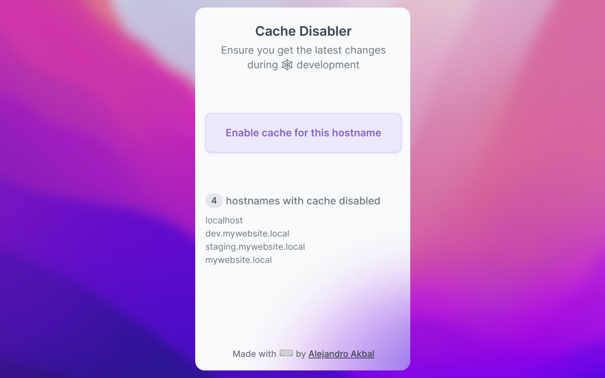

<p align='center'>
  
</p>

<h1 align='center'>
Cache Disabler
</h1>

**Browser extension to effortlessly disable the browser cache.**

This extension is quite similar to the "disable cache" function in Developer Tools.
But without the need to keep them continuously open.



## Get the extension

[](https://chrome.google.com/webstore/detail/kemenddblaeehafanidlkolmdgdeffbp)
[](https://addons.mozilla.org/en-US/firefox/addon/cache-disabler/)

## Getting Started

First, run the development server:

```bash
pnpm dev
# or
npm run dev
```

Open your browser and load the appropriate development build. For example, if you are developing for the chrome browser,
using manifest v3, use: `build/chrome-mv3-dev`.

You can start editing the popup by modifying `popup.vue`. It should auto-update as you make changes. To add an options
page, simply add a `options.tsx` file to the root of the project, with a react component default exported. Likewise to
add a content page, add a `content.ts` file to the root of the project, importing some module and do some logic, then
reload the extension on your browser.

For further guidance, [visit our Documentation](https://docs.plasmo.com/)

## Making production build

Run the following:

```bash
pnpm build
# or
npm run build
```

This should create a production bundle for your extension, ready to be zipped and published to the stores.

## Submit to the webstores

The easiest way to deploy your Plasmo extension is to use the built-in [bpp](https://bpp.browser.market) GitHub action.
Prior to using this action however, make sure to build your extension and upload the first version to the store to
establish the basic credentials. Then, simply
follow [this setup instruction](https://docs.plasmo.com/framework/workflows/submit) and you should be on your way for
automated submission!

### Zipping the extension

If you want to manually zip the extension source code for submission, you can run the following:

```bash
git archive -o extension.zip HEAD
```